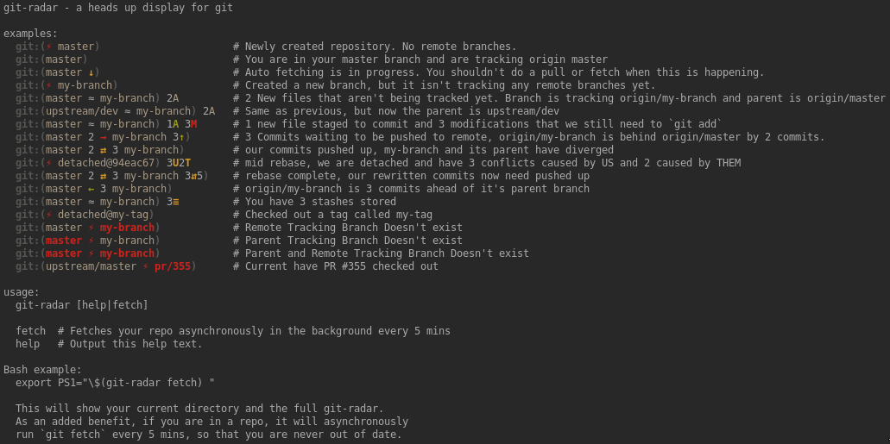

# Go-Git-Radar

This is a HUD for git repos.

This project was inspired heavily on
[michaeldfallen/git-radar](https://github.com/michaeldfallen/git-radar), except
that I have rewritten it in golang instead of using bash scripts.

The display is also almost identical because I like the way that it worked but I
have changed a few things about how the remotes are shown.

There are 2 main reasons for the existence of this project:

1. I was interested in learning Go and needed something to do with it
2. I really like git-radar, but it isn't being actively developed right now and
   hasn't seen any activity in some time.

## Differences between git-radar and go-git-radar

As mentioned, most of the output is the same, but there are some differences.

1. There is built in support for a git config option for your branches called
   `git-radar-parent-remote`. This holds the name of the remote branch that your
   current branch is based off of. go-git-radar uses the parent remote to
   replace the fancy `m` that git-radar showed when remotes diverged. This is to
   give you more information about how your branch differs from your parent. It
   also uses this parent to compare to instead of always using origin/master.
2. Remotes branches are now shown with their remote name, unless the remote name
   is `origin` and then it is just implied, in order to make the prompt shorter.
3. The parent remote is always shown if you are not in a branch that tracks
   `origin/master` now.

See the below `help` output below for some examples.

Note: that your colours may differ, as I am using a gruvbox theme for my
terminal.

Note: that the help output uses your config file, which means that changes you
make to your config file will be reflected in the help output, so you can see
how your formatting or colour changes will affect how certain situations are
displayed.



## Usage

### Show the Help

```bash
$ git-radar help
```

### Run Git Radar

```bash
$ git-radar
```

Note that this won't output anything if you are not in a git repository.

### Run Git Radar With Auto Fetching

```bash
$ git-radar fetch
```

Note that this won't output anything if you are not in a git repository.

Auto fetching is also done asynchronously, so you don't need to wait for the
fetch to complete before you get your terminal prompt back.

### Add git-radar to your prompt

Add something like this to your .bashrc file.

```bash
export PS1+="\$(go-git-radar fetch)"
```

The `fetch` is optional if you do not want auto fetching.

The `\` before the `$(` is important as it escapes the execution of the call.
This means that every time your prompt loads up it will be called and therefore,
updated.

## Setup and Install

You can either download the latest release or clone the `master` branch.

You will need to have golang installed in order to build it and you will need to
copy the `config.go.example` to `config.go` and change any config options you
want and then build it.

Build the program with:

```bash
$ make
```

or

```bash
$ make build
```

### Recommended Git Alias

Git Radar uses a custom git configuration to keep track of what the parent
remote branch of your current branch is. This is so that Git Radar can tell you
when your current remote branch is ahead or falls behind the parent.

When I refer to a parent, I mean the branch that you branched from in order to
make the branch that you are in currently. The presumption here is that
eventually you will be merging back into that branch later, so knowing how far
ahead or behind you are from it would help.

This is a Git alias I created which automatically sets the git config option
when you create a branch.

```bash
  cob = "!f() { \
      currentTracking=\"$(git for-each-ref --format='%(upstream:short)' \"$(git symbolic-ref -q HEAD)\")\"; \
      if [ -z \"$currentTracking\" ]; then \
        echo \"Could not determine tracking info for current branch.\"; \
        return; \
      fi; \
      git checkout -b \"$1\"; \
      git config --local branch.\"$(git rev-parse --abbrev-ref HEAD)\".git-radar-parent-remote \"$currentTracking\"; \
    }; \
    f"
```

Now, when you want to create a new branch just do:

```bash
$ git cob <new-branch-name>
```

This will create a new branch and check it out for you, but will also set the
configuration in your local gitconfig file.

If you don't set this git config variable, it will always compare you to
origin/master.

### Configuration

Have a look at the `config.go.example` file for all of the configurable options.

If something doesn't make sense or is confusing please either open a PR and fix
it, or open an issue and let me know so I can clear it up.

In short, the entire prompt is designed to be completely customizable, so you can
make your go-git-radar prompt look however you want.
